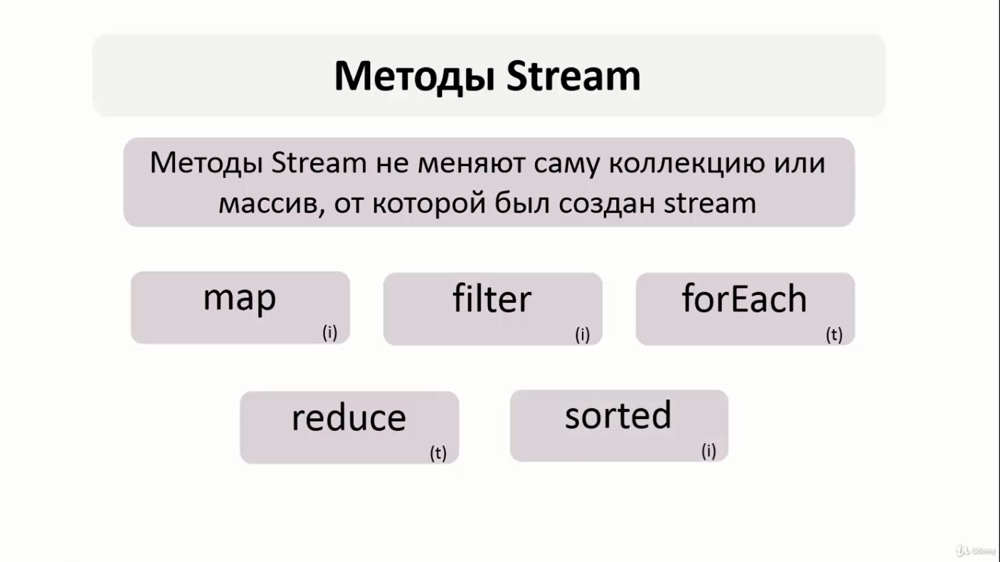
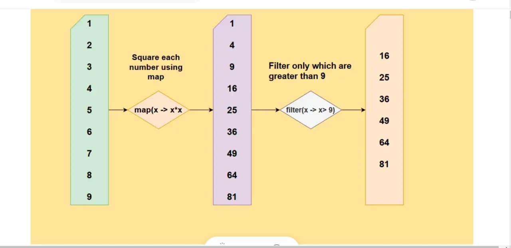
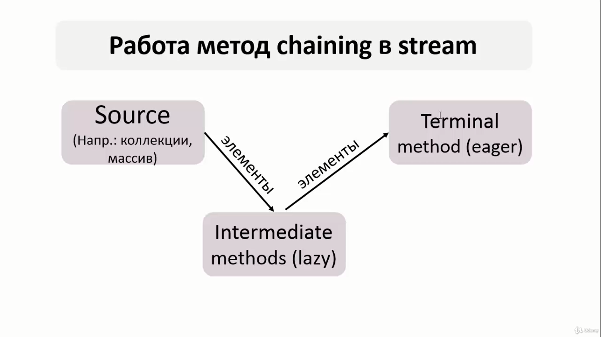
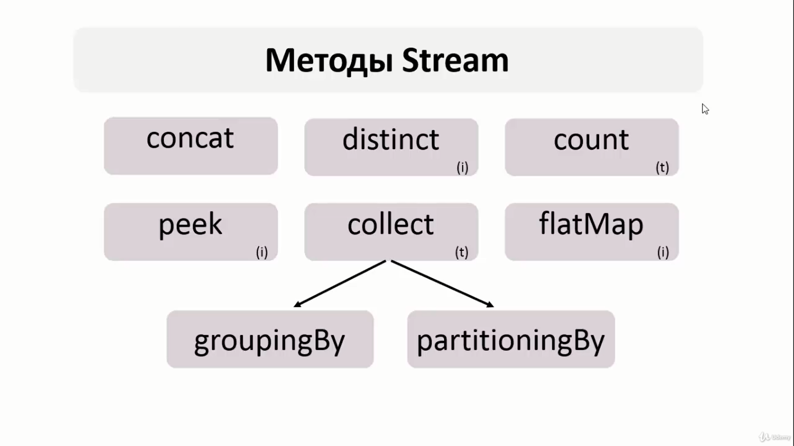

//интермейдит терминальный
List Conversions
`List<Character> strList = Arrays.asList('H', 'e', 'l', 'l', 'o');
System.out.println("List converted to string representation:\n" + strList.toString());
String string = strList.toString()
.substring(1, 3 * strList.size() - 1)
.replaceAll(", ", "");
`
`String string=  strList.stream().map(String::valueOf).collect(Collectors.joining());
`Convert List To String
Converting List To An Array
Convert Array To List
Convert List To Set
Convert Set To List
Array Vs List
Frequently Asked Questions
Conclusion
Recommended Reading
